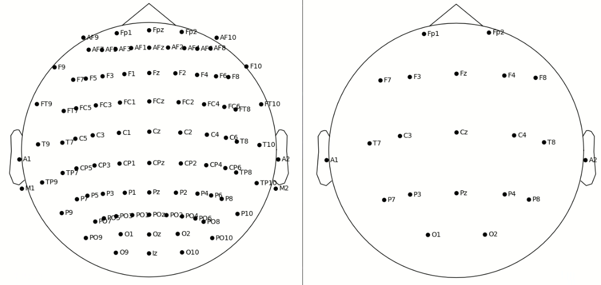
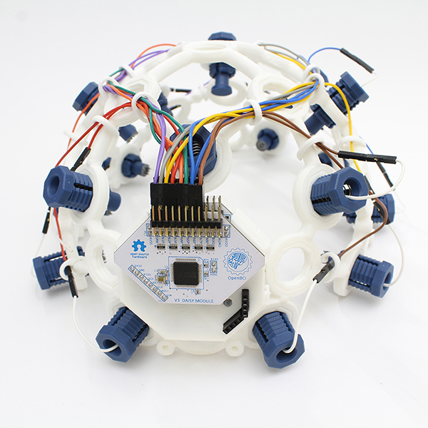
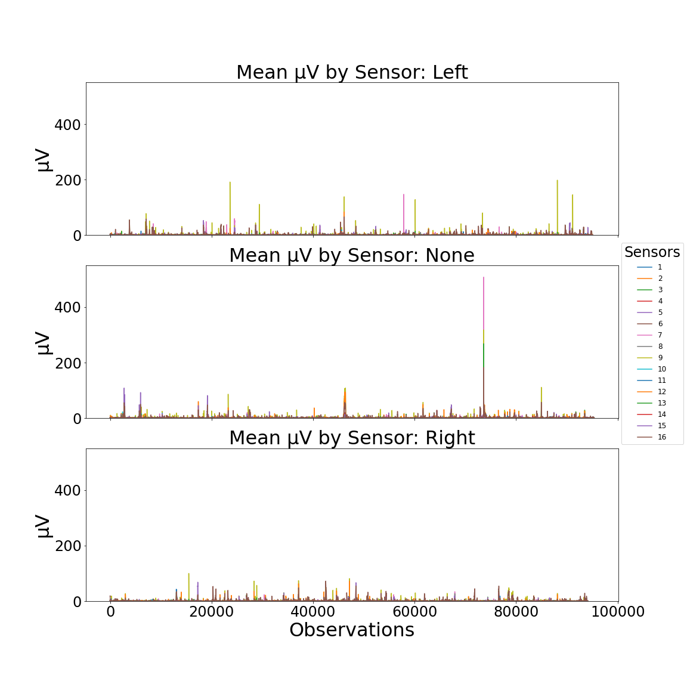
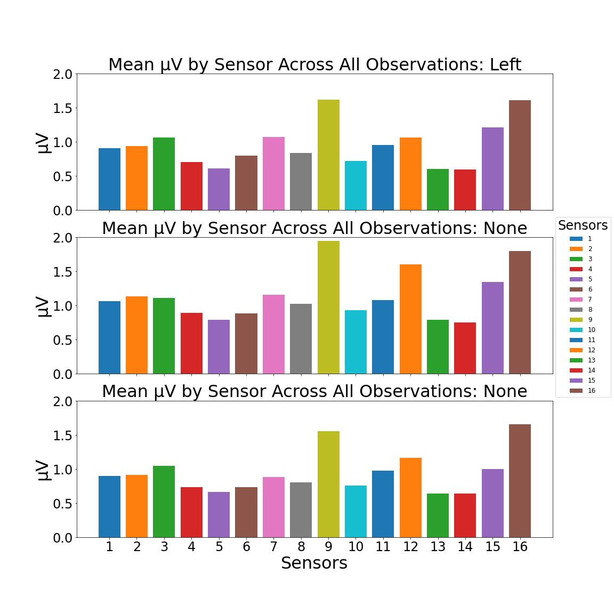
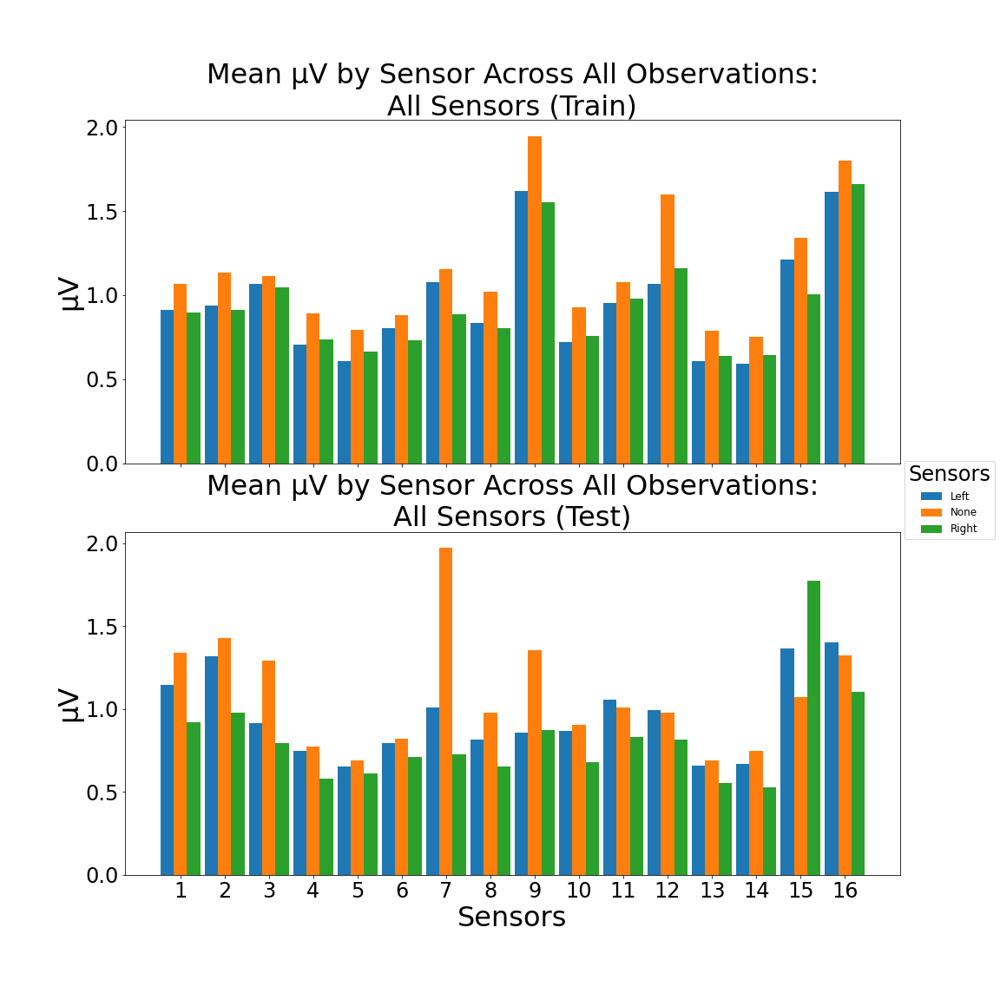
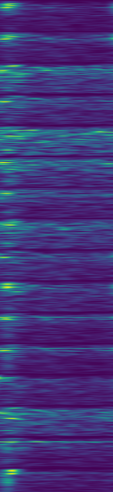
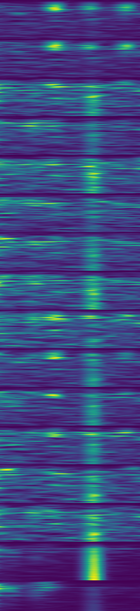
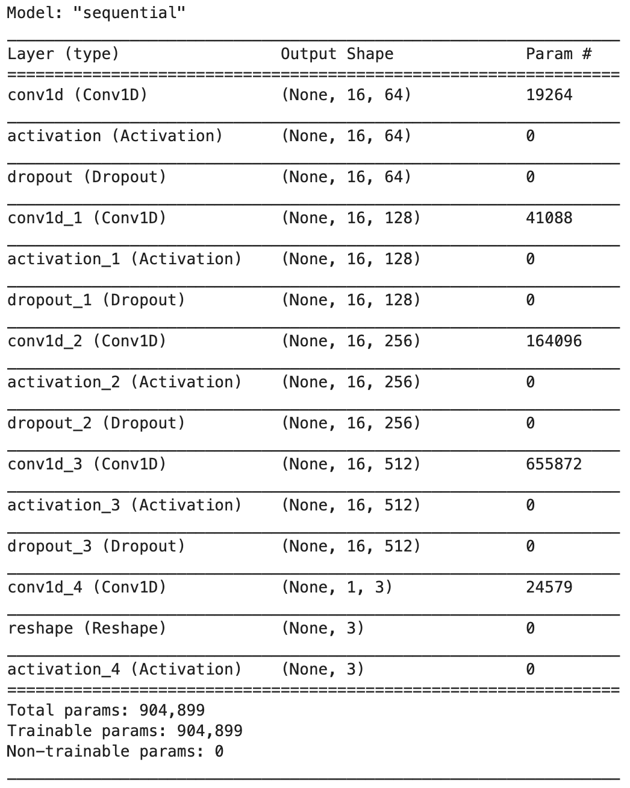
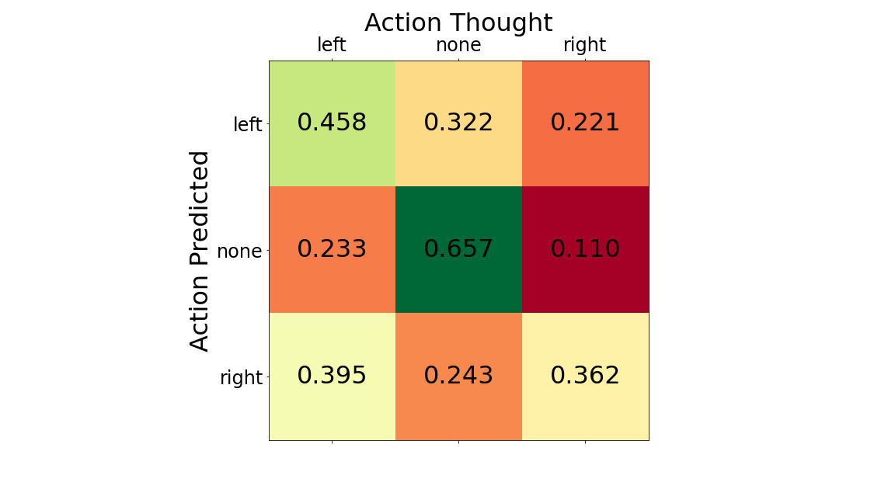

# Using a Non-Invasive BCI to Predict Directional Thought

---

## Table of Contents

* [Background](#background)
* [Goals](#goals)
* [Data](#data)
* [Data Visualization](#data-visualization)
* [Model](#model)
    * [Baseline](#baseline)
    * [Model Structure](#model-structure)
    * [Model Performance](#model-performance)
* [Conclusions](#conclusions)
* [Next Steps](#next-steps)

## Background

Electroencephalography (EEG) is a non-invasive means of measuring electrical activity, e.g. excitatory postsynaptic potential, inhibitory postsynaptic potentials, on the scalp which represents the macro electrical activity of the cerebral cortex. More simply, EEGs measure depolarizations and hyperpolarizations across a brain region and between electrodes.

Each electrode used during an EEG has a particular naming convention. Here is a simplified version of the rules:

* Even electrodes are on the right
* Odd electrodes are on the left
* z is used to denote a midsagittal electrode
* A letter code denotes the region of the brain
    * Pre-frontal: Fp
    * Frontal: F
    * Temporal: T
    * Parietal: P
    * Occipital: O
    * Central: C

There are several standards for collecting EEG data. One such is called the Standard 10-20. This montage can be expanded or restricted by adding or removing electrodes to allow for greater or lesser granularity.

---

## Goals

* Build a model that can accurately differentiate between `left`, `none`, or `right` thoughts
* Incorporate this model into a quick UI to control the mouse, pong paddle, etc

---

## Use Case

There are more than 5,000,000 Americans who are living with various levels of paralysis. This impedes their ability to interact with the external world. Brain computer interfaces, when they are efficacious enough, will allow for those with disabilities to regain independences. The will be able to use the internet, create varied art, contribute to science, and run business. All of which can currently be done, but the interfaces are clunky and the ability to read and write data is slow.

---

## Data

The [data](https://hkinsley.com/static/downloads/bci/model_data_v2.7z) was obtained from a [OpenBCI EEG headset](https://shop.openbci.com/collections/frontpage/products/all-in-one-biosensing-r-d-bundle?variant=13043151994952). The headset contained 16 sensors aligned in a Standard 10-20 montage. A single individal recorded 1,230 EEGs. Each eeg was roughly 10 seconds in length where he intently focused on thinking `left`, `none`, or `right`.

The EEG sampled at 25 Hz across all 16 sensors and the raw data was passed through the fast fourier transform (FFT) algorithm. There are 60 discrete Hz ranges with each having a microvoltage (µV) reading.

---

## Data Visualization

There are notable differences that can be visually identified. The following plots exemplify this.

This plot was used to identify which sensors have the greatest variation between the `left`, `none`, and `right` thoughts. Sensors 7 & 15 appeared to contain the greatest amount of signal and were later isolated to train models.

Spectrograms were created from the FFT data as an alternative means of feeding the data into various models. Each of the sensors are the major subdivisions seen across the y axis with the time series data across the x axis and the color being the strength of the µV reading.

Left & Right

---

## Model

Numerous types of models were tested to determine which would be best for the FFT data and the spectrogram data.

* CNNs
* Gradient Boosting
* KNNs
* Logistic Regression
* LSTMs
* Transfer Learning
    * MobileNet
    * VGG19
    * Xception

More or less, only the CNNs were better than random on initial inspection. A plethora of different CNNs were tested with most resulting in severe overfitting, e.g. `acc: 0.99`, `val_acc: 0.38`. The overfitting was addressed by removing layers, having fewer nodes per layer, adding dropout layers, and adding regularization to the layers. Most of this was largely ineffective.

### Baseline

Random chance was used as a basline. There is a 1/3 probability that the correct thought is selected.

### Model Structure

### Model Performance

https://user-images.githubusercontent.com/33579895/129062312-2243972c-53f9-442e-8fbe-62ffbb030c51.mp4

---

## Conclusions

---

## Next Steps

* Get More Data
* Add More Users
* Train for Longer
* Get Access to Raw EEG Data
* Add Mechanism for Testing Individualized Data on Web
* Turn PyGame App into a Game to Train Users & Models
