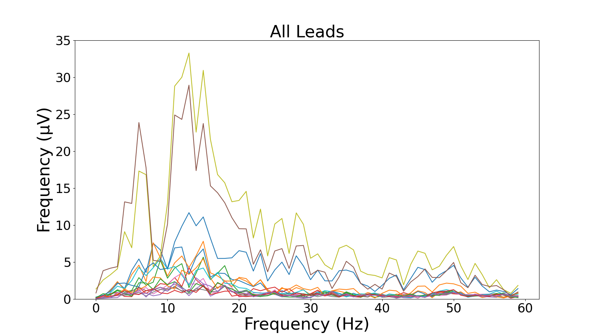

# Using the .py Files

Note: The docstrings are relatively complete and should be easy to follow.

## Making Spectrograms

Use `python3 array_2_spectrogram.py` to convert all of the FFT data into spectrograms.

## Training the Model

Use `python3 build_models.py` to compile and train the best CNN structure.

## Data Shape

Use `python3 data_shape.py` to obtain the shape of the data.

## Loading the Data

Use `python3 load_data.py` to load the data. This is largely unneeded because it is called by `build_models.py` & `model_predictions.py`

## Save .csv of Predictions and Target

Use `python3 model_predictions.py` to save a .csv of the predictions and target.

## Save Images of the Sensor Data Over Time

Use `python3 save_fft_images.py` to make these:

